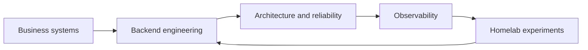

## Hi 👋 I’m Danilo Ramos, but you can call me Don.

I’m a **backend software engineer** who enjoys turning complex operational problems into reliable, observable and maintainable systems. Over 9+ years, I’ve worked across logistics, fintech, healthtech and education.

My main stack is **Kotlin, Spring Boot, PostgreSQL and Docker**. I also use **Python** for automation, observability tooling, AI-enabled products and personal projects.

I care about more than making software work: domain modeling, system boundaries, failure modes, testing, operational visibility and making the next change safer. I’ve worked with microservices, asynchronous workflows, internal platforms, integrations and systems running at scale.

More recently, I’ve been building **LLM-powered products**, including conversational platforms, retrieval and context workflows, file ingestion and agent integrations. I also use AI-assisted engineering tools such as **Codex, Claude and Cursor** as part of implementation, research, debugging, documentation and automation.

Outside work, I maintain a small **homelab** where I experiment with Linux, containers, networking, observability and self-hosted services.

## ⭐ Selected projects

### Product engineering

- [**CraftControl**](https://github.com/dgaramos/craftcontrol) — a mobile-first control center for self-hosted Minecraft Bedrock servers, with access control, backups, telemetry and a documented modular-monolith architecture.
- [**Transaction Authorizer**](https://github.com/dgaramos/transaction-authorizer) — a Kotlin/Spring Boot API demonstrating domain routing, PostgreSQL persistence, Flyway migrations and hexagonal architecture.

### Observability and operations

- [**Minecraft Bedrock Exporter**](https://github.com/dgaramos/minecraft-bedrock-exporter) — a security-conscious Prometheus exporter for container, world and server metrics.
- [**AdGuard Exporter**](https://github.com/dgaramos/adguard-exporter) — client-focused DNS visibility and Grafana dashboards for AdGuard Home.
- [**PS3 Exporter**](https://github.com/dgaramos/ps3-exporter) — Prometheus metrics for a PlayStation 3 running webMAN MOD.
- [**dotfiles**](https://github.com/dgaramos/dotfiles) — my reproducible development environment, managed with chezmoi.

### Foundations

- [**AutoTAM-TCC**](https://github.com/dgaramos/AutoTAM-TCC) — my undergraduate decision-support system and software engineering thesis project.
- [**SEKE 2016 research**](https://www.linkedin.com/in/dgaramos/) — co-author of research on choosing content management systems using the Technology Acceptance Model.

These projects reflect the intersection I enjoy most: backend engineering, architecture, operational tooling, observability and systems that are useful beyond a toy example.

## 🧪 Currently building

I’m using a Raspberry Pi-based homelab to explore:

- Prometheus, Grafana, Loki and Alloy
- Linux services, containers and networking
- DNS and network observability
- Secure self-hosted deployments
- Small tools that make infrastructure easier to understand and operate

## 🔧 Main stack

  <code></code>
  <code></code>
  <code></code>
  <code></code>
  <code></code>
  <code></code>

`Kotlin` · `Python` · `Spring Boot` · `PostgreSQL` · `Docker` · `Prometheus` · `Grafana` · `Linux` · `Distributed Systems` · `Event-Driven Architecture` · `AI-Assisted Engineering`

## 📬 Let’s connect

